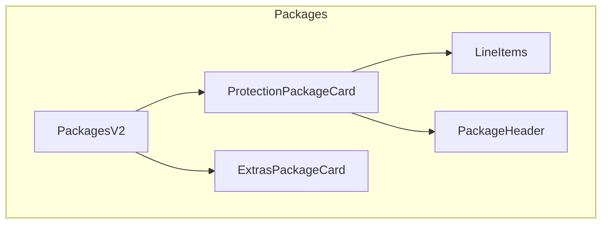

# 🧪 Cursor Quality Suite

> Code Quality & Testing Commands for Cursor IDE - Test Generation, Mutation Testing, Architecture

[](https://www.npmjs.com/package/cursor-quality-suite)
[](https://opensource.org/licenses/MIT)

## 🚀 Quick Install

```bash
npx cursor-quality-suite
```

One command installs 7 code quality commands for Cursor.

## What is Quality Suite?

Quality Suite provides advanced testing and code quality tools:

- **Risk-Based Testing** - Generate tests for high-risk code paths
- **Mutation Testing** - Verify test quality catches real bugs
- **Architecture Visualization** - Generate Mermaid diagrams
- **Pattern Detection** - Find architectural drift

## 📦 Command Bundles

| Bundle | Commands | Use Case |
|--------|----------|----------|
| **Minimal** | 3 | Testing only |
| **Standard** | 7 | + Code quality |

## 🔧 Commands Reference

### 🧪 Testing

| Command | Description |
|---------|-------------|
| `/risk-test-gen` | Generate tests for high-risk paths (payments, auth) |
| `/mutation-audit` | Verify test quality via mutation testing |
| `/write-unit-tests` | Generate comprehensive unit tests |

### 📊 Code Quality

| Command | Description |
|---------|-------------|
| `/visualize-architecture` | Generate Mermaid diagrams for any scope |
| `/code-standards` | Reference guide for quality enforcement |
| `/pattern-drift` | Detect when code diverges from patterns |
| `/churn-map` | Find high-churn files needing attention |

## 💡 Example Usage

### Generate High-Risk Tests

```
/risk-test-gen src/features/checkout

════════════════════════════════════════════════════════════════
  RISK ANALYSIS
════════════════════════════════════════════════════════════════

| Line | Risk | Type | Coverage |
|------|------|------|----------|
| 45 | 🔴 CRITICAL | Booking modification | ❌ Untested |
| 78 | 🟠 HIGH | API call | ✅ Partial |

════════════════════════════════════════════════════════════════
  GENERATED TESTS
════════════════════════════════════════════════════════════════

## 1. Integration Test: Booking Modification (CRITICAL)

✅ Generated: 3 test suites, 8 test cases
✅ Coverage improvement: +35% on high-risk paths
```

### Mutation Testing Audit

```
/mutation-audit src/components/Checkout.tsx

════════════════════════════════════════════════════════════════
  MUTATION TESTING RESULTS
════════════════════════════════════════════════════════════════

| Metric | Value |
|--------|-------|
| Total Mutants | 45 |
| Killed | 32 |
| Survived | 13 |
| **Mutation Score** | **71%** 🟠 |

## Survived Mutants (Tests Failed to Catch)

| Line | Original | Mutation |
|------|----------|----------|
| 78 | `price > 0` | `price >= 0` |
```

### Architecture Diagram

```
/visualize-architecture src/components/Packages

Output:


## 🛠️ CLI Commands

```bash
npx cursor-quality-suite              # Interactive install
npx cursor-quality-suite --bundle standard -y  # Non-interactive
npx cursor-quality-suite status       # Check installation
npx cursor-quality-suite list         # List all commands
npx cursor-quality-suite help         # Show help
```

## 📂 Installation Structure

After installation:

```
.cursor/
└── commands/
    ├── risk-test-gen.md
    ├── mutation-audit.md
    ├── write-unit-tests.md
    ├── visualize-architecture.md
    ├── code-standards.md
    ├── pattern-drift.md
    └── churn-map.md
```

## 🤝 Works With

- [Buddy OS](https://github.com/sharath317/buddy-os) - Role-aware autonomous agent
- [Cursor Full-Flow](https://github.com/sharath317/cursor-full-flow) - Jira to PR automation
- [Cursor AI Toolkit](https://github.com/sharath317/cursor-ai-toolkit) - Learning & context

## 📄 License

MIT © Sharath Chandra

---

**Ship higher quality code with AI-powered testing.**
