# Visualize Architecture - Generate Diagrams (v4.1)

Create visual diagrams (Mermaid) for architecture, data flow, component relationships, and **frontend-specific patterns**.

## Usage

```
/visualize-architecture {SCOPE}
/visualize-architecture {SCOPE} --type={diagram_type}
/visualize-architecture {SCOPE} --data-flow           # Props vs Context analysis
/visualize-architecture {SCOPE} --boundaries          # Suspense/Error boundaries
/visualize-architecture {SCOPE} --xstate              # XState-compatible state chart
```

## Diagram Types

### Available Types

| Type         | Use Case                                    |
| ------------ | ------------------------------------------- |
| `component`  | Component hierarchy and relationships       |
| `sequence`   | Request/data flow through system            |
| `class`      | Class/interface relationships               |
| `state`      | State machine for complex logic             |
| `flowchart`  | Decision trees and workflows                |
| `er`         | Entity relationships (data models)          |
| `dataflow`   | **NEW:** Props vs Context data flow         |
| `boundaries` | **NEW:** Suspense/ErrorBoundary locations   |
| `xstate`     | **NEW:** XState-compatible state definition |

### Auto-Detection

If `--type` not specified, I'll auto-detect based on scope:

-   React components → `component` diagram
-   API/hooks → `sequence` diagram
-   Types/interfaces → `class` diagram
-   State machines / reducers → `state` diagram
-   Context providers → `dataflow` diagram

## Examples

### Component Hierarchy

```
/visualize-architecture src/features/checkout/src/components/Packages
```

Output:


### Sequence Diagram (Data Flow)

```
/visualize-architecture useBookingData --type=sequence
```

Output:


### State Diagram

```
/visualize-architecture BookingFlow --type=state
```

Output:


### Class Diagram (Types)

```
/visualize-architecture src/types/Booking --type=class
```

Output:


## AI Execution

When user runs `/visualize-architecture {SCOPE}`:

### Step 1: Analyze Scope

```
1. Identify files/folders in scope
2. Detect primary pattern (components, hooks, types)
3. Select appropriate diagram type
4. Extract relationships
```

### Step 2: Generate Diagram

```
1. Parse code structure
2. Identify nodes (components, functions, types)
3. Map relationships (imports, props, calls)
4. Generate Mermaid syntax
```

### Step 3: Render

```mermaid
{generated_diagram}
```

### Step 4: Offer Variations

```
📊 Architecture Diagram Generated

Variations available:
1. Add more detail (show props/methods)
2. Simplify (high-level only)
3. Different view (sequence instead of component)
4. Focus on specific path

Which variation? (1/2/3/4/done)
```

## Integration

### With Documentation

```
/visualize-architecture {SCOPE} --output=docs/architecture/
```

Creates:

-   `{scope}-diagram.md` with Mermaid
-   Links from relevant component docs

### With PR Description

```
/visualize-architecture --pr-diff
```

Generates diagram showing:

-   Files changed
-   Relationships affected
-   New connections added

## Tips

1. **Start broad, then narrow**

    ```
    /visualize-architecture src/features/checkout  # Overview
    /visualize-architecture src/features/checkout/src/hooks  # Focus
    ```

2. **Use for onboarding**

    ```
    /visualize-architecture --key-flows
    ```

    Generates diagrams for critical paths

3. **Before refactoring**
    ```
    /visualize-architecture {target} --show-coupling
    ```
    Highlights tightly coupled components

---

## 🆕 Frontend-Specific Diagrams (v4.1)

### Data Flow Diagram (Props vs Context)

```
/visualize-architecture src/features/checkout/src/components/Checkout --data-flow
```

Output:


**Legend:**

-   Solid lines = Props drilling
-   Dashed lines = Context consumption
-   Blue = Context-based data
-   Orange = Prop-based data

### Suspense & Error Boundaries Map

```
/visualize-architecture src/features/checkout --boundaries
```

Output:

```mermaid
graph TD
    subgraph "App Root"
        ROOT[App]
        EB1[ErrorBoundary: AppError]
    end

    subgraph "Routes"
        R1[/checkout]
        R2[/checkout/payment]
    end

    subgraph "Suspense Zones"
        S1[Suspense: CheckoutSkeleton]
        S2[Suspense: PaymentSkeleton]
    end

    subgraph "Async Components"
        AC1[VehicleDetails - lazy]
        AC2[PackageList - lazy]
        AC3[PaymentForm - lazy]
    end

    ROOT --> EB1
    EB1 --> R1
    EB1 --> R2

    R1 --> S1
    S1 --> AC1
    S1 --> AC2

    R2 --> S2
    S2 --> AC3

    style EB1 fill:#ffcdd2
    style S1 fill:#c8e6c9
    style S2 fill:#c8e6c9

    classDef errorBoundary fill:#ffcdd2,stroke:#c62828
    classDef suspense fill:#c8e6c9,stroke:#2e7d32
```

**Analysis includes:**

-   ErrorBoundary coverage (red zones)
-   Suspense boundaries (green zones)
-   Lazy-loaded components
-   Missing boundaries (warnings)

### XState-Compatible State Chart

```
/visualize-architecture useCheckoutFlow --xstate
```

Output:


**XState Export:**

```typescript
// Generated XState machine definition
export const checkoutMachine = createMachine({
    id: 'checkout',
    initial: 'idle',
    states: {
        idle: {
            on: { FETCH_VEHICLE: 'loading' },
        },
        loading: {
            invoke: {
                src: 'fetchVehicle',
                onDone: 'vehicleLoaded',
                onError: 'error',
            },
        },
        // ... full machine
    },
});
```

### Component Render Tree with Re-render Analysis

```
/visualize-architecture {SCOPE} --render-analysis
```

Shows:

-   Which components re-render on state changes
-   Memo boundaries
-   Context consumer impact zones

```mermaid
graph TD
    subgraph "Re-renders on booking change"
        A[CheckoutPage 🔄]
        B[VehicleSection 🔄]
        C[PriceDisplay 🔄]
    end

    subgraph "Memoized (stable)"
        D[Header ⚡]
        E[Footer ⚡]
        F[StaticContent ⚡]
    end

    A --> B
    A --> C
    A --> D
    A --> E

    style A fill:#ffecb3
    style B fill:#ffecb3
    style C fill:#ffecb3
    style D fill:#c8e6c9
    style E fill:#c8e6c9
```



**Legend:**

-   🔄 Yellow = Re-renders on state change
-   ⚡ Green = Memoized / Stable

## Integration with /plan-and-budget

When running `/plan-and-budget`, optionally generate:

```
/plan-and-budget "Add new feature" --with-diagram
```

Includes architecture diagram in the plan showing:

-   Current state
-   Proposed changes
-   Impact zones
